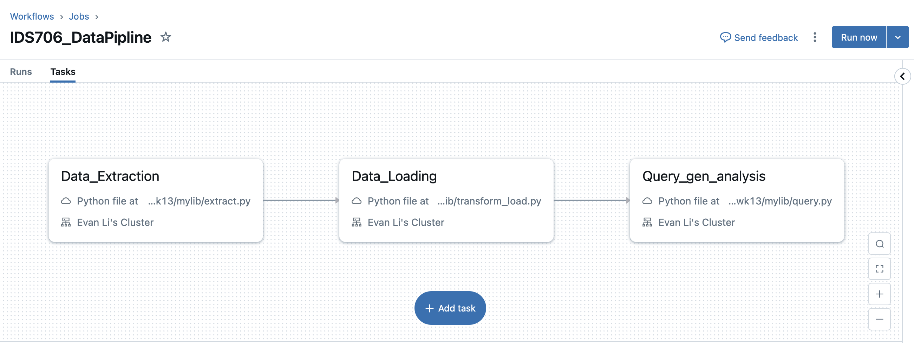
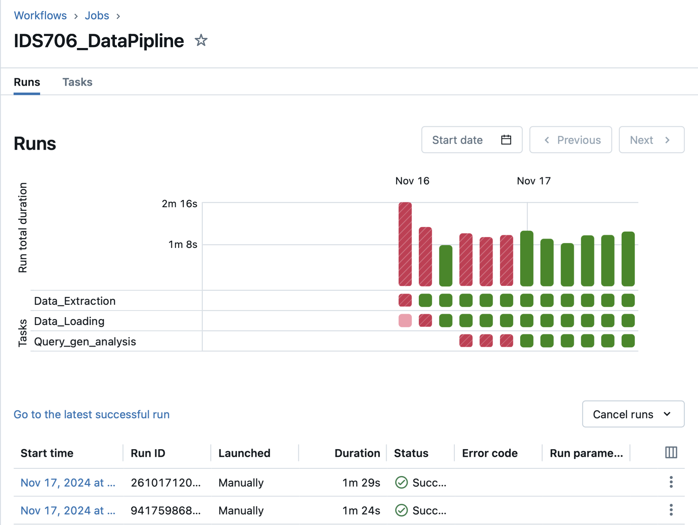
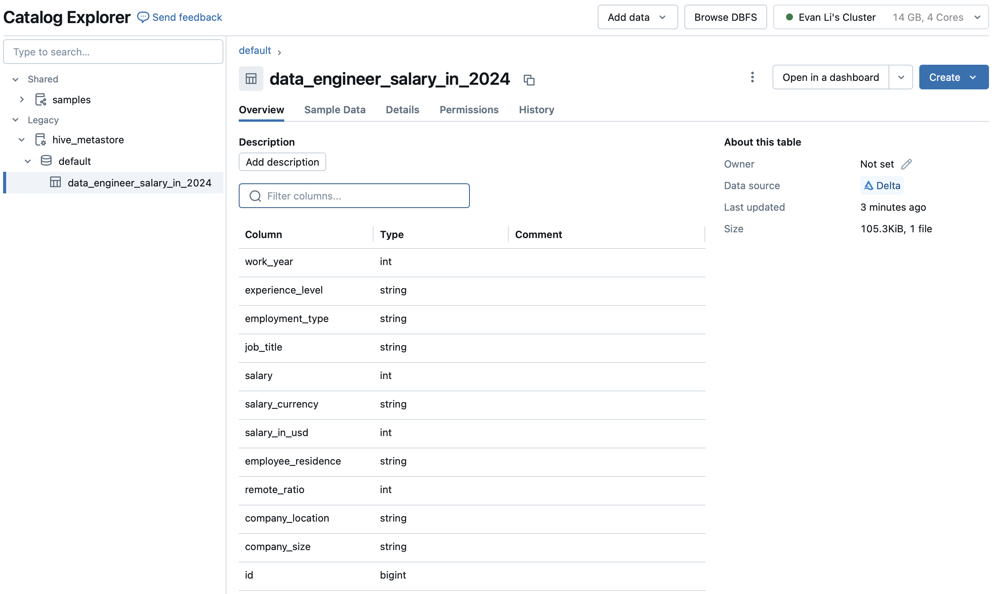

# Data Pipeline with Databricks

## Overview
The Data Extraction and Transformation Pipeline project aims to retrieve and process tennis match data from fivethirtyeight datasets, specifically using Databricks in conjunction with the Databricks API and various Python libraries.

## Preparation

### Databricks Environment Setup
I used the student version of Azure to create a Databricks server. Then I saved the environment variables into local file `.env` and GitHub Secrets for authentication, such as `ACCESS_TOKEN ` `SERVER_HOSTNAME` `REPO_ID` `JOB_ID`.

### Code Preparation:
1. Install all dependencies: `make install`
2. Format code: `make format`
3. Lint code: `make lint`
4. Update the repository in Databricks `make sync_repo`
5. Trigger the Databricks job and download the analysis result `make run_job`

## Key Components & Features

### 1. Data Extraction: `extract.py`

In the Databricks server, download compressed data files, then extract CSV data files, and store the data in the Databricks FileStore.

### 2. Data Transformation and Load: `transform_load.py`

Transform the csv file in the Databricks FileStore into a Spark dataframe which is then converted into a Delta Lake Table and stored in the Databricks environement.

### 3. Query and Analysis: `query.py`

Defined multiple Spark data access and analysis tasks, including:
- Calculates descriptive statistics for salaries (count, mean, stddev, quartiles)
- Generates job title distribution analysis
- Analyzes experience level distribution
- Computes salary statistics by experience level
- Implements Spark SQL queries to analyze high-paying jobs
- Performs complex data transformations using DataFrame API
- Creates salary range categories and calculates distributions

And generates analysis results in markdown format, storing them in the Databricks FileStore.

### 4. Databricks Data Pipline Setup
Set up a Job in Databricks that links to the above three files in the Workspace, with the topology as follows:

In Databricks, this Job will execute the complete Data Pipeline. It will automatically download the code and extract it into the database, then perform queries and analysis.

### 5. Updating repository in Databricks Workspace: `sync_databricks.py`

Using Databricks' RESTful APIs, after setting up the REPO_ID, this component can automatically specify to git pull the latest code from Github into the Workspace. Since each task in the Data Pipeline is directly connected to the code files in the Workspace, the latest code will be executed every time the Job runs.

### 6. Triggering the Data Pipline: `main.py`
In the main function, using Databricks' RESTful APIs, after setting up the JOB_ID, it can automatically trigger Job execution and block waiting, querying the Job's status every 15 seconds. After the Job completes, it calls the API again to download the analysis results markdown file stored in Databricks FileStore to local storage.

### 7. Automatic repository updates and Job triggers: `cicd.yml`
After configuring everything, add `ACCESS_TOKEN`, `SERVER_HOSTNAME`, `REPO_ID`, `JOB_ID` and other secrets to the Github repository's Secrets. Then set up in GitHub Action to automatically update the repository in Databricks Workspace after each push, then automatically trigger the Job to execute the Data Pipeline with the latest code. Finally, automatically download the analysis results and push to update this repository again.

## Execution of Data Pipeline
GitHub Automatic Job Execution:

Automatically download data and create the following Delta Lake Tables:

You can find the analysis result here：[Pyspark Output Data/Summary Markdown File](analysis_results.md)

## Dataset Overview

The data is sourced from [Kaggle's Data Engineer Salary in 2024 dataset](https://www.kaggle.com/datasets/chopper53/data-engineer-salary-in-2024). This dataset provides insights into data engineer salaries and employment attributes for the year 2024. It includes information such as:
   - Salary
   - Job title
   - Experience level
   - Employment type
   - Employee residence
   - Remote work ratio
   - Company location
   - Company size